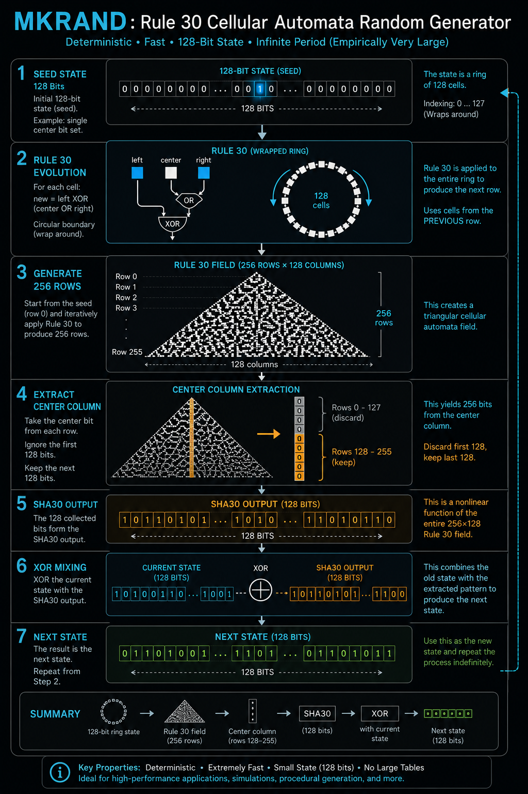

## Implementation Overview

MKRAND is a deterministic bit generator built around the repeated application of a cellular automaton.

Unlike conventional random number generators that rely on entropy sources, MKRAND generates complexity from a simple deterministic state transition rule.



### Seed

The system begins with a 128-bit seed.

The canonical seed contains a single set bit positioned at the center of an otherwise empty 128-bit segment.

```text
0000000000000000000000000001000000000000000000000000000000000000
```

This seed serves as the initial state of the generator.

---

### Field Generation

MKRAND applies Rule 30, a one-dimensional cellular automaton first studied by Stephen Wolfram.

Each bit in the next row is computed from its left, center, and right neighbors.

The process produces a growing field of binary patterns:

```text
                1
               111
              11001
             1101111
            110010001
           ...
```

Although the rule is deterministic, the resulting patterns exhibit highly irregular and complex behavior.

---

### SHA30 Transformation

To derive a new state from an existing state, MKRAND performs the following operation:

1. Generate a Rule 30 field from the current seed.
2. Construct a square field of evolution steps.
3. Extract the center column of the generated field.
4. Use the extracted column as a deterministic transformation of the original state.

This transformation is referred to as **SHA30**.

```text
Seed
  ↓
Rule 30 Evolution
  ↓
Square Field
  ↓
Center Column Extraction
  ↓
SHA30 Output
```

The SHA30 output has the same width as the original seed.

---

### State Transition

A new state is generated by XORing the current state with its SHA30 transformation.

```text
Next State =
    Current State
    XOR
    SHA30(Current State)
```

This operation produces a new 128-bit segment while preserving deterministic reproducibility.

---

### Random Stream Generation

The generator repeatedly applies the state transition function:

```text
State₀
  ↓
State₁
  ↓
State₂
  ↓
State₃
  ↓
...
```

Each generated state contributes bits to an output stream.

The resulting sequence forms a deterministic pseudo-random bit stream.

---

### Byte Stream Extraction

Generated segments are flattened and grouped into bytes.

```text
State Stream
    ↓
Bit Stream
    ↓
8-Bit Groups
    ↓
Byte Stream
```

This allows MKRAND to be used as a source of deterministic random bytes.

---

### One-Time Pad Example

The generated byte stream can be XORed with arbitrary data.

```text
Plaintext
    XOR
Random Stream
    ↓
Ciphertext
```

Because XOR is involutive:

```text
(A XOR B) XOR B = A
```

the same operation can be used for both encryption and decryption.

```text
Plaintext
    ↓ XOR Stream
Ciphertext
    ↓ XOR Same Stream
Plaintext
```

As long as both parties possess the same seed, the original message can be recovered exactly.

---

### Design Principles

MKRAND is designed around several core principles:

- Deterministic execution
- Explicit state transitions
- Reproducible outputs
- No hidden entropy sources
- Simple logical primitives
- Cellular automata as the source of complexity

The implementation focuses on treating randomness as an emergent property of deterministic state evolution rather than as a direct product of physical entropy collection.